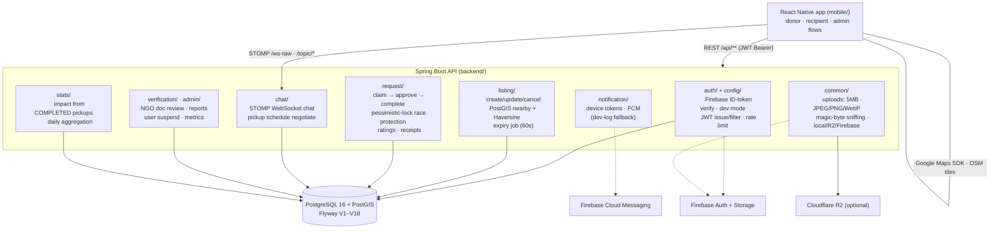

# Khadya Bachao — Smart Food Surplus Redistribution System

Monorepo containing:

- `backend/` — Spring Boot 3.5 REST API + WebSocket STOMP (Java 17, PostgreSQL + PostGIS + Flyway)
- `mobile/` — React Native app (Android first)

## Architecture



External services are optional in dev: without Firebase credentials the backend runs a dev-login path and logs notifications; uploads default to local disk.

## Demo & Test Accounts

See [DEMO_ACCOUNTS.md](./DEMO_ACCOUNTS.md) for 25 pre-seeded test accounts (5 for each role: Admin, Donor, Recipient NGO, Recipient Individual, Volunteer) with full activity data.

## Quick start (local dev)

### 1. Start PostgreSQL

```bash
docker compose up -d postgres
```

> Mapped to host port **5433** to avoid clashing with other local Postgres on 5432.

### 2. Run the backend

```bash
cd backend
DB_PORT=5433 ./mvnw spring-boot:run
```

**Full local mode** (real Firebase auth + FCM + Cloudflare R2 storage): all
credentials live in the gitignored `backend/.env.local` — load it first:

```bash
cd backend
set -a; source .env.local; set +a   # Firebase + R2 + DB port
./mvnw spring-boot:run
```

- Health: http://localhost:8080/api/health
- Swagger: http://localhost:8080/swagger-ui.html

Without a Firebase service account the API runs in **dev mode**:
`POST /api/auth/dev/login {"email","name"[,"role"]}` issues a JWT so every
flow is testable end-to-end. Set `FIREBASE_ENABLED=true` +
`FIREBASE_CREDENTIALS_PATH=service-account.json` for production token
verification (the dev endpoints disappear automatically).

Migrations: Flyway applies `src/main/resources/db/migration/V*__*.sql` on boot.

### 3. Run the mobile app

```bash
cd mobile
npm install
npm run android   # Android emulator/device; backend must be running
```

`.env` holds `API_BASE_URL` (`http://10.0.2.2:8080` targets your host from the
emulator) and `GOOGLE_MAPS_API_KEY`.

For Google Maps tiles on Android provide a key either via env:

```bash
GOOGLE_MAPS_API_KEY=xxx cd mobile/android && ./gradlew assembleDebug
```

or as `googleMapsApiKey=xxx` in `mobile/android/gradle.properties`.
FCM push is dormant until you add `google-services.json` + set
`FIREBASE_ENABLED=true` in `.env`.

## Deployment

### Backend (Docker)

```bash
JWT_SECRET='<64+ random chars>' docker compose --profile full up -d --build
```

Builds `backend/Dockerfile`, starts Postgres + API behind the compose network.
Deploy anywhere containers run (EC2, Render, Railway); front it with HTTPS.

### Mobile release build

```bash
cd mobile/android && ./gradlew assembleRelease
# -> app/build/outputs/apk/release/app-release.apk (signed, Play internal track ready)
```

Signing uses `android/keystore.properties` (gitignored) pointing at
`android/keystore/khadyabachao-release.keystore`. **Keep both safe — losing
the keystore loses the ability to update the app.** CI without the file falls
back to the debug key.

Point release builds at your production API in `mobile/.env.production`
(`API_BASE_URL=https://api.yourdomain.com`) before building.

## Security checklist status

- [x] Stateless JWT auth (24h expiry, `/api/auth/refresh` sliding session)
- [x] Firebase ID-token verification path (Admin SDK) + dev fallback
- [x] Role-based access (`@PreAuthorize`) on donor/recipient/admin endpoints
- [x] Input validation on all write endpoints (`jakarta.validation`)
- [x] Parameterized queries only (JPA/Hibernate)
- [x] Upload limits: 5MB; JPEG/PNG/WebP enforced by **magic-byte sniffing** (declared type must match actual bytes)
- [x] Per-IP rate limiting on auth + write endpoints (configurable via `RATE_LIMIT_MAX_REQUESTS` / `RATE_LIMIT_WINDOW_MS`)
- [x] Deactivated accounts rejected at the auth-filter level
- [x] Dev auth backdoor disabled under the `prod` profile; prod Flyway pass deactivates demo accounts; Swagger off in prod
- [ ] TLS termination at reverse proxy (deployment concern)
- [ ] Swap dev image storage → S3/GCS/Firebase Storage before scaling

## Documentation

- [PROJECT_AUDIT.md](./PROJECT_AUDIT.md) — feature-by-feature audit matrix, defect log, mock-functionality disposition
- [API_DOCUMENTATION.md](./API_DOCUMENTATION.md) — every endpoint: auth, roles, payloads, errors
- [TEST_PLAN.md](./TEST_PLAN.md) — automated suites, live E2E verification, manual device matrix
- [FULL_CODE_AUDIT.md](./FULL_CODE_AUDIT.md) — line-by-line security/quality audit with remediation status
- [RELEASE_GUIDE.md](./RELEASE_GUIDE.md) · [DEMO_ACCOUNTS.md](./DEMO_ACCOUNTS.md)

## Testing

```bash
cd backend && ./mvnw test        # unit + Testcontainers integration (needs Docker)
cd mobile && npm test            # jest
cd mobile && npx tsc --noEmit    # typecheck
```

CI runs all of this on every push (see `.github/workflows/`).
